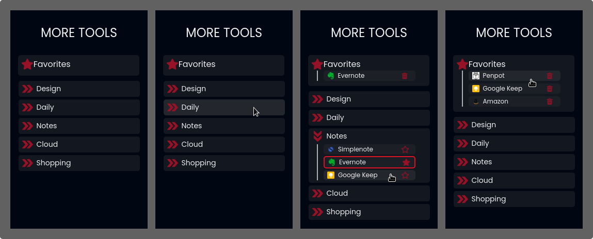

# MoreTools extension



## About the project

More tools is a web browser extension that provides urls of useful web applications for some use categories. It was developed with the aim of expedite the realization process of your tasks through tools that can help their progress.

- 5 categories of web applications

- Favorite function

- Simple design

- Quick and easy acess to helpful tools

The key idea is to be **practical, simple, useful and objective.**

## Why

This project was been created with the objective of increase my experience level on programming. I wanted to create something that could be useful or help people in some way, so this project came up.
Feel free to use this in the way you wish, as well as to provide me any feedback about it.

Connect with me on [LinkedIn](https://www.linkedin.com/in/lucas-zacarias-/)

## Future ideas

- Light and Dark theme selector

- Suport for other languages

## How to use

### Adding from the github

> 1. Clone the repository
>    
>    ```
>    $ git clone https://github.com/L-Zack/moreTools-extension
>    ```
> 
> 2. Open [Chrome extensions tab](chrome://extensions/)
> 
> 3. Click on *Load unpacked*
> 
> 4. Search the Translate for Me folder among your files